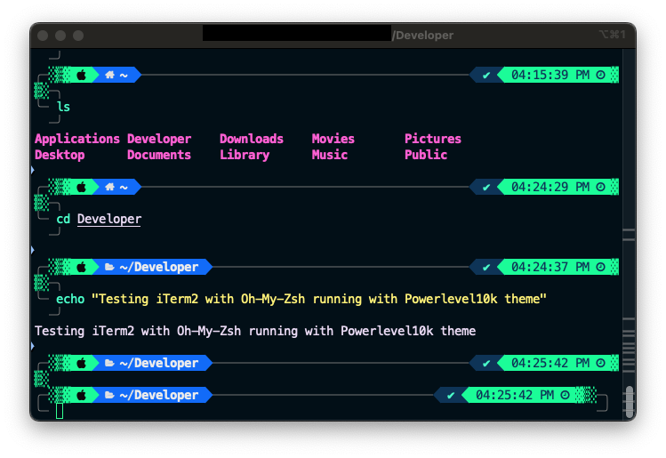

# Beautify Your Mac Terminal: A Modern Setup Guide

Tired of your default macOS Terminal? This guide walks you through setting up a modern, efficient, and visually appealing terminal environment on macOS.



---

## Quick Setup

Run the commands below in your terminal for a complete setup. If your machine uses Privilege Management software (like BeyondTrust), see the "Privilege Management Install" section for Homebrew.

---

### 1. Install Homebrew

**Homebrew** is a package manager that simplifies installing software on macOS.

#### Standard Install

```bash
/bin/bash -c "$(curl -fsSL https://raw.githubusercontent.com/Homebrew/install/HEAD/install.sh)"
echo 'eval "$(/opt/homebrew/bin/brew shellenv)"' >> ~/.zprofile
eval "$(/opt/homebrew/bin/brew shellenv)"
```

#### Privilege Management Install

If the standard installer fails, use the custom script from this repository:

```bash
chmod a+x homebrew-install.sh
./homebrew-install.sh
brew -v
```

---

### 2. Install Essential Tools

Install iTerm2 and Git:

```bash
brew install --cask iterm2
brew install git
```

Install Oh My Zsh:

```bash
sh -c "$(curl -fsSL https://raw.githubusercontent.com/ohmyzsh/ohmyzsh/master/tools/install.sh)"
```

---

### 3. Install Powerlevel10k Theme

Clone the theme:

```bash
git clone https://github.com/romkatv/powerlevel10k.git ${ZSH_CUSTOM:-~/.oh-my-zsh/custom}/themes/powerlevel10k
```

Set the theme in your `.zshrc`:

1. Open `~/.zshrc` in your editor:
    ```bash
    vi ~/.zshrc
    ```
2. Set:
    ```zsh
    ZSH_THEME="powerlevel10k/powerlevel10k"
    ```
3. Save and exit.

Reload your shell:

```bash
source ~/.zshrc
```

Follow the Powerlevel10k configuration wizard. If it doesn't start automatically, run:

```bash
p10k configure
```

---

### 4. Install Zsh Plugins

**Autosuggestions:**

```bash
git clone https://github.com/zsh-users/zsh-autosuggestions ${ZSH_CUSTOM:-~/.oh-my-zsh/custom}/plugins/zsh-autosuggestions
```

**Syntax Highlighting:**

```bash
git clone https://github.com/zsh-users/zsh-syntax-highlighting.git ${ZSH_CUSTOM:-~/.oh-my-zsh/custom}/plugins/zsh-syntax-highlighting
```

Add plugins to your `.zshrc`:

1. Open `~/.zshrc` and set:
    ```zsh
    plugins=(git zsh-autosuggestions zsh-syntax-highlighting web-search)
    ```
2. Save and exit.

Reload your shell:

```bash
source ~/.zshrc
```

---

## Customization Files

This repository includes:

- `homebrew-install.sh`: Custom Homebrew installer for machines with privilege management.
- `coolnight.itermcolors`: Custom iTerm2 color scheme.

### How to Use `coolnight.itermcolors`

1. Download `coolnight.itermcolors`.
2. Open iTerm2 Preferences (`Cmd + ,`).
3. Go to **Profiles > Colors**.
4. Click **Color Presets... > Import...** and select the downloaded file.
5. Choose **coolnight** from the Color Presets dropdown.

---

### (Optional) VSCode Configuration

To use the Powerlevel10k font in VSCode's integrated terminal, add this to your `settings.json`:

```json
"terminal.integrated.fontFamily": "MesloLGS NF"
```
**Note for Windows Users:**  
I put together this modern Mac Terminal setup guide for fun! Even though it's focused on macOS, feel free to check it out for inspiration or ideas. Let me know what you think!
